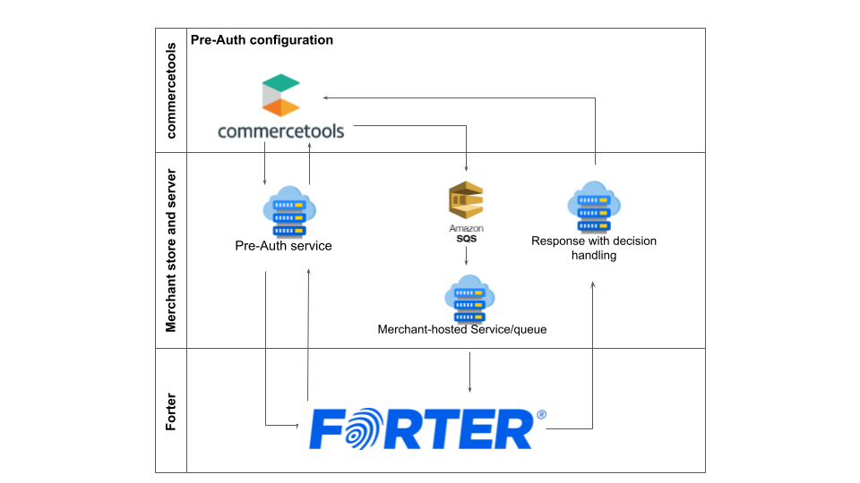

# Forter Commercetools App

---

{{ Placeholder for a heading text about the app from Forter }}

---

### Integration Architecture

#### Forter-Commertetools pre-auth flow

#### Forter-Commertetools post-auth flow (using Amazon SQS)

---

* [App setup guide](./docs/setup-guide.md)

* [App configuration guide](./docs/images/configuration-guide.md)

* [How to get Commercetools API Credentials](./docs/how-to-get-commercetools-api-credentials.md)

* [Forter custom schema mapping guide](./docs/forter-schema-custom-mapping-guide.md)

* [Frontend preparations guide](./docs/frontend-preparations.md)

* [AWS-SQS docs](https://docs.aws.amazon.com/AWSSimpleQueueService/latest/SQSDeveloperGuide/sqs-setting-up.html)

* [Forter docs](https://docs.forter.com/)

* [Laravel docs](https://laravel.com/docs/10.x)

---

    
    

