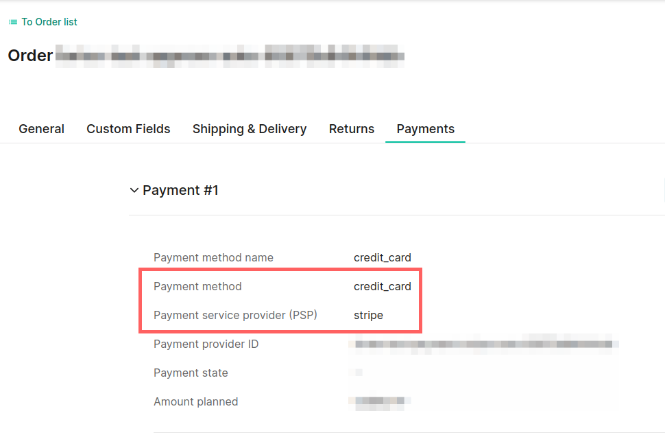
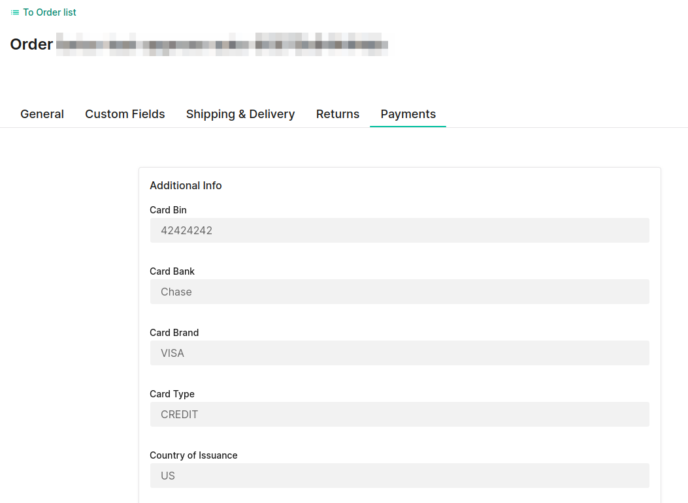

# Forter Schema - Custom Mapping Guide

In order to get a decision from Forter, the app prepares a schema of the order and payment data sends to Forter for validation ([example schema](./forter-schema-examples/order-validation.json)).
During this process, common order and payment fields are being mapped to Forter's definded fields.
Since different sites and payment solutions may use different fields, and in order to send all available payment info, it's highly recommended to prepare and map the local fields to Forter's fields.
For example, by default, Forter will look for the credit-card expiration month in a custom payment field named `expirationMonth`. If your payment solution saves it in a field named `ccExpMonth`, you'll have to map this field to the `expirationMonth` field so it won't be missed.
This guide will explain how to do that.

---

Make sure that your payment methods are using the `paymentMethodInfo.paymentInterface` and `paymentMethodInfo.method` fields on the Commercetools payment object. This app expects `paymentMethodInfo.paymentInterface` to represent the gateway/PSP identifier (e.g., `stripe`, `adyen`, `paypal`, ...) and `paymentMethodInfo.method` to represent the payment method type (e.g., `credit_card`, `paypal`, ...). It's highly recommended to make sure these fields are not empty on the payment.



---

Make sure your payment sulution saves the payment addtional info on Commercetools's payment custom fields, and explore the actual field names that they are using.



---

On the app config dir, there's a file named [`forter_schema_custom_mapping.php.example`](../config/forter_schema_custom_mapping.php.example), duplicate this file and set the new file name to `forter_schema_custom_mapping.php`. This file is an example custom mapping file template, and a good starting point.
Now map Forter's schema fields to the corresponding fields on your site (using the format: `"forter-field-name" => "custom-field-name"`).

##### Map order fields:
Make sure you collect the Forter token, and at least the customer's IP and User-Agent on the site front, save it on the cart custom-fields and pass it to the order's custom fields upon order creation (see [this guide] about frontend preparations(./frontend-preparations.md)).
You may use the default fields (`forterToken`, `customerIP`, `customerUserAgent`) and keep the mapping as is, or map to your own defiend names:
```
/**
  * custom.{fieldName} or {fieldName} => look in the order's custom fields (default)
 */
'order' => [
    //'orderId' => 'orderNumber', // Uncommect for using 'orderNumber' as orderId (instead of 'id')

    'connectionInformation' => [
        'customerIP' => 'customerIP',                             // [required!] Map to the order custom-field that holds the customer IP.
        'forterMobileUID' => 'forterMobileUID',                   // Map to the order custom-field that holds the forterMobileUID (if used).
        'forterTokenCookie' => 'forterToken',                     // [required!] Map to the order custom-field that holds the Forter token.
        'merchantDeviceIdentifier' => 'merchantDeviceIdentifier', // Map to the order custom-field that holds the merchantDeviceIdentifier (if used).
        'userAgent' => 'customerUserAgent',                       // [required!] Map to the order custom-field that holds the customer user-agent.
    ],
]
```

##### Map payment method to Forter' payment schema type:
Map any local/custom payment method (`paymentMethodInfo.method`) to Forter's payment schema type (`creditCard`, `paypal`, ...).
For example, if your payment solution sets the payment method name for credit-card payments to "c_card", let the app know that it's a creditCard method by adding the line `"c_card" => "creditCard"` to this list.
*Replace spaces with underscores (turn `Credit Card` into `Credit_Card`).
```
/**
 * Map the paymentMethodInfo[method] name to Forter's payment schema type
 */
'payment_method_schema_type' => [
    'cc' => 'creditCard',
    'credit_card' => 'creditCard',
    'visa' => 'creditCard',
    'paypal' => 'paypal',
    'paybright' => 'installmentService',
    /* Route any local/custom payment method (paymentMethodInfo[method]). Replace spaces with underscores */
]
```

##### Map payment additional info fields:
Map the payment custom-fields to the schema by payment methid type.
If you only use one payment solution that allows creditCard payments, you may add the fields immediately under `creditCard` (these would be the default mapping for creditCard payments). If you have more than one payment solution that allows creditCard payments, and if they use different fields, you may set paymentInteface specific settings (e.g., set `'payment.creditCard.bin' => 'cardBin'`, `'payment.creditCard.stripe.bin' => 'ccBin'`, `'payment.creditCard.adyen.bin' => 'creditCardBin'`, ...).
* These fields are expected to be json-decoded: `fullResponsePayload`, `paymentProcessorData`, `verificationResults`, `fullPaypalResponsePayload`.
```
/**
  * payment.{fieldName} => look in the payment root object
  * paymentMethodInfo.{fieldName} => look in the payment's paymentMethodInfo object
  * custom.{fieldName} or {fieldName} => look in the payment's custom fields (default)
 */
'payment' => [
    'creditCard' => [
        // Defaults:
        "bin" => "cardBin",
        "cardBank" => "cardBank",
        "cardBrand" => "cardBrand",
        "cardType" => "cardType",
        "countryOfIssuance" => "countryOfIssuance",
        "expirationMonth" => "expirationMonth",
        "expirationYear" => "expirationYear",
        "nameOnCard" => "nameOnCard",
        "lastFourDigits" => "lastFourDigits",
        "fingerprint" => "fingerprint",
        "fullResponsePayload" => "fullResponsePayload",
        "paymentProcessorData" => "paymentProcessorData",
        "verificationResults" => "verificationResults",

        // PaymentInterface specific:
        'stripe' => [
            // "bin" => "cardBin",
            // "cardBank" => "cardBank",
            // ...
        ],

        // PaymentInterface specific:
        'adyen' => [
            // "bin" => "cardBin",
            // "cardBank" => "cardBank",
            // ...
        ],
    ],

    'paypal' => [
        "authorizationId" => "authorizationId",
        "payerAccountCountry" => "payerAccountCountry",
        "payerAddressStatus" => "payerAddressStatus",
        "payerEmail" => "payerEmail",
        "payerId" => "payerId",
        "payerStatus" => "payerStatus",
        "paymentGatewayData" => [
            "gatewayName" => "paymentMethodInfo.method",
            "gatewayTransactionId" => "gatewayTransactionId",
        ],
        "paymentId" => "paymentId",
        "paymentStatus" => "payment.paymentStatus",
        "fullPaypalResponsePayload" => "fullPaypalResponsePayload",
        "protectionEligibility" => "protectionEligibility",

        // PaymentInterface specific:
        'adyen' => [
            // "authorizationId" => "authorizationId",
            // "payerAccountCountry" => "payerAccountCountry",
            // ...
        ],
    ],

    'applePay' => [
        "cardBank" => "cardBank",
        "cardBrand" => "cardBrand",
        "cardType" => "cardType",
        "countryOfIssuance" => "ccCountryOfIssuance",
        "creationTime" => "creationTime",
        "expirationMonth" => "expirationMonth",
        "expirationYear" => "expirationYear",
        "nameOnCard" => "nameOnCard",
        "lastFourDigits" => "lastFourDigits",
        "fingerprint" => "fingerprint",
        "token" => "token",
        "fullResponsePayload" => "fullResponsePayload",
        "paymentProcessorData" => "paymentProcessorData",
        "verificationResults" => "verificationResults",

        // PaymentInterface specific:
        // ...
    ],

    'androidPay' => [
        "bin" => "cardBin",
        "cardBank" => "cardBank",
        "cardBrand" => "cardBrand",
        "cardType" => "cardType",
        "countryOfIssuance" => "ccCountryOfIssuance",
        "creationTime" => "creationTime",
        "expirationMonth" => "expirationMonth",
        "expirationYear" => "expirationYear",
        "nameOnCard" => "nameOnCard",
        "lastFourDigits" => "lastFourDigits",
        "fingerprint" => "fingerprint",
        "token" => "token",
        "threeDSecure" => "threeDSecureData",
        "fullResponsePayload" => "fullResponsePayload",
        "paymentProcessorData" => "paymentProcessorData",
        "verificationResults" => "verificationResults",

        // PaymentInterface specific:
        // ...
    ],

    'installmentService' => [
        "serviceName" => 'cardType',
        "serviceResponseCode" => 'serviceResponseCode',
        "paymentId" => 'transactionId',
        "fullResponsePayload" => 'fullResponsePayload'

        // PaymentInterface specific:
        // ...
    ]
]
```
