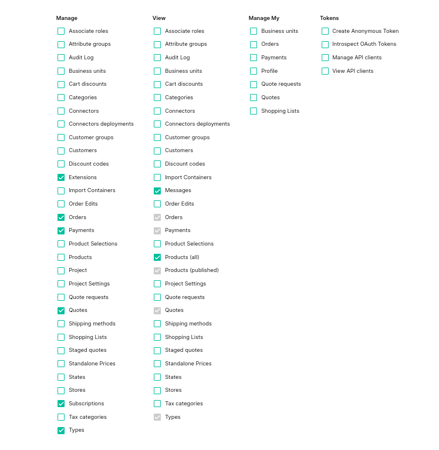

# How to get Commercetools API Credentials

Login to your Commercetools admin panel (mercant center).
From your project view, navigate to **Settings > Developer Settings** and click on **Create new API client**.
Give it a name (e.g., "forter-commercetools-app"), and select these scopes:

`manage_extensions`, `manage_orders`, `manage_payments`, `manage_quotes`, `manage_subscriptions`, `manage_types`

`view_products`, `view_messages`

Click on **Create API client**, download/copy the credentials, and add to your app's [configuration](./configuration-guide.md).

* On the `.env` file, the value of `CTP_SCOPES` should be wrapped with quotes (CTP_SCOPES="...")
* If region is not included, you may extract that from the API URL (e.g., if `CTP_API_URL` is `https://api.europe-west1.gcp.commercetools.com`, set `CTP_REGION` to `europe-west1.gcp`).
